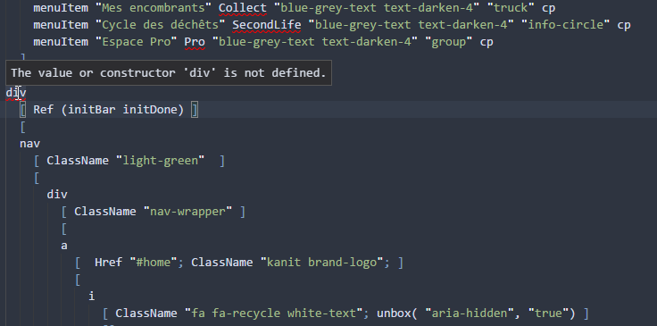
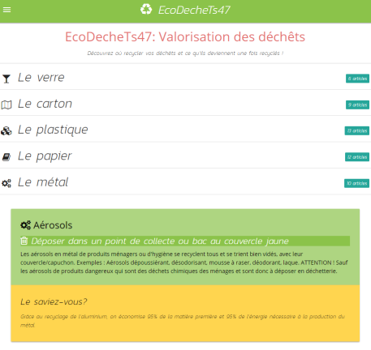
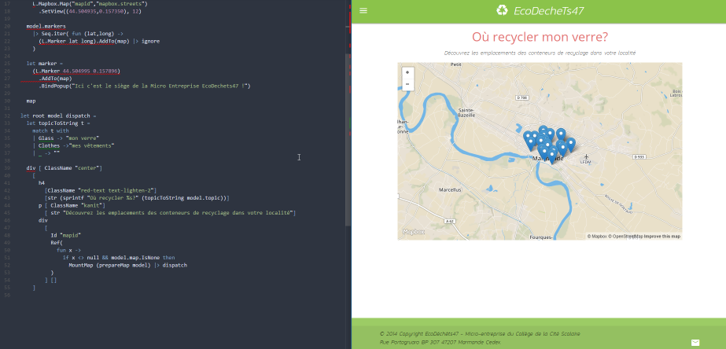

  - tagline: How Fable allows for rapid and robust development

# How Fable helped kids win a contest

> Yesterday, when I fell asleep, it was with the clear memory of smiles shining on the faces of our kids. After several months of hard work, they did it. They **won the Junior Achievement Young Entreprise** regional contest organized in Bordeaux and were qualified for the National contest!

Every year, kids all over the world, try to learn how to build their own startup from scratch and promote their work through a contest organized by regional branches of [JA Worldwide](https://www.jaworldwide.org/aboutja/), one of the world’s largest youth-serving NGOs.

The [Collège de la Cité de la Formation](http://www.collegecitescolaire.com/) in Marmande, France was participating for the 6th time to this contest with a clear motivation: **make something that could help the environmental cause**, and of course, since they were creating a startup, find a way to make some profit.

When they started the project this year it was as usual from scratch but with one technical requirement: create a mobile app. So they contacted me to see if that would be possible.

Making an app, even with today’s technology is clearly time consuming and even more when we need to deploy the app on stores. So since we were talking about 3 hours of work on the project by week, it was not an option.
However, I offered them to make a **mobile-friendly web app** so that we could actually release something. As long as it would work on mobile they were ok. So we had a deal.

The technical part of the project, although the visible part, represents **only a few percents** of the work actually done by kids.
They have a few months to make a real project with a detailed business plan and take care of every possible subject relative to setting up a company: HR management, accountability, commercial partnerships, and so on.
At the end a Jury of professionals from well known groups like the [Thales Foundation](http://foundation.thalesgroup.com/) vote for a project after a thorough analysis: they just want to know make sure it is based on some innovation, either economic or social or technical and it can be done and is profitable.
In our case, the kids have deployed treasures of creativity and pragmatism to come with their concept and have even won a special Prize rewarding their Business Model, price sponsored by the Thales Foundation.

After several prototypes and of course many failures **the final concept came very late, in April, one month before the actual contest**. I knew I would not have lots of time to make the web app but here alarm bells were ringing everywhere. It was an emergency project and I could not fail.

In my luck, I had been working on a new promising tech stack for a few months: [Fable](http://fable.io/), a F# based Javascript transpiler that offered many great tools to develop robust web applications faster than light. One of these tools is [Fable-Elmish](https://fable-elmish.github.io/elmish/), an architecture that works on top of [React](https://facebook.github.io/react/) using [Elm language](http://elm-lang.org/)'s paradigm.

So I started the project just before the Pâques French holidays. The kids had already designed some mockups  so I just had to start coding. Then during the holidays, every morning, I would code for a few hours and then ask the kids for their opinions on Facebook. Then I would update the web app from their contributions.
We worked like this for two weeks until we reached our goal: the frontend was ready for the contest!

We decided to postpone the back-office since it was clear that due to our planning constraints, school for them, work for me, we could not make it prior to the contest. It could come later. The F# [Suave](https://suave.io/) server was already serving the site so it would not be complicated to continue the work.

Overall, the development was a no-brainer.
Of course the prototype was not meant to be complicated. We just wanted to show the overall concept: **It was not a difficult project. Here the main problem was the lack of time**.

However coding with the [Ionide](http://ionide.io/) [plugin](https://marketplace.visualstudio.com/items?itemName=Ionide.Ionide-fsharp) on [Visual Studio Code](https://code.visualstudio.com/) just streamlined my workflow. The IDE would give me completion and hints when I did not know some API methods. It would also help me correct my errors on fly. And the only difficult issues I stumbled on with Fable-Elmish were rapidly solved thanks to the awesome Fable community.

I also needed to use my **javascript components**. Here again Fable allowed me to **integrate them in F# like a breeze and of course, definitely typed**. This is what I call real [javascript interoperability](https://medium.com/fable-compiler/f-interop-with-javascript-in-fable-the-complete-guide-ccc5b896a59f).
So in a few hours I checked all the boxes in my Todo. Responsive web app: check. Navbar: check. Sticky footer: check. Accordion components: check. Mobile drag out side menu: check. Mapbox integration in react component: check.

Of course, I would not have coded the prototype without Fable’s watch mode. During the development, my screen was split into two windows: the IDE on the left, the browser on the right. Each time I saved my files, the browser would refresh the display.

I have been using many languages to build web and mobile apps through the years: Javascript, Java, Scala, Haxe, and lately F#.I would like to stress the fact that the F# language solves a lot of cognitive overhead I had with pure object apps.

I remember about 10 years ago, when the creator of the Haxe language told me:
>“François you should try functional languages. Try Ocaml. It will change your way of thinking”.

Well, finally I reached the functional land thanks to Scala before boarding on the F# rocket. Here, I feel safe, I feel at home.

Last but not least, **building any kind of project means being able to communicate and solve problems with the help of others**.
And here I had the opportunity to live that more than once. On one side: **Kids helping each other to make their dream come true**. Us, adults, helping kids to work together as a team and of course, the **greatness of a truly human dedicated open source community**.

In the end, I could have done it differently with other tech stacks. But I would like to stress that on the path I chose, **it’s the sum of all the benefits from these tools and the support of the community that allowed me to help the kids reach their goal in due time**.

**In the end, Kids, as a team, reached their goal.**
**And once more, F# and the awesome Fable community won my respect.**

>Let's meet up: if you want to know more about Fable and its awesome community please join us at the [FableConf](https://www.eventbrite.es/e/fableconf-bordeaux-tickets-34089709238).
