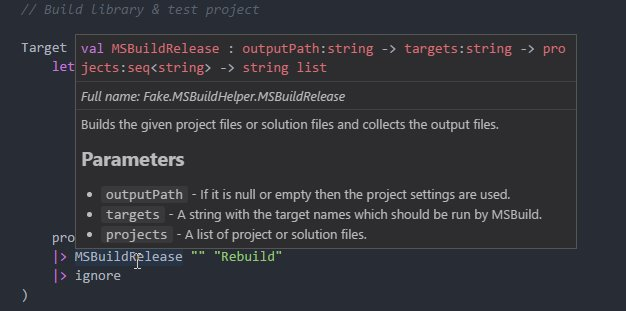

 - tagline: Light webs load faster!

# Tree Shaking with Fable

Hi everybody! This is my first contribution to the [F# advent calendar](https://sergeytihon.wordpress.com/2016/10/23/f-advent-calendar-in-english-2016/) and you'll probably be very surprised to know it will be about... Fable! Yes, the lightweight F# compiler that emits JavaScript you can be proud of (or at least I'll be). This time I want to talk you about one of the exciting new features introduced in [Fable 0.7](blog/Introducing-0-7.html): tree shaking.

----------------

From the very fist version, Fable compiles F# code to JavaScript using [ES2015 features](https://babeljs.io/docs/learn-es2015/) like classes or iterators, and then uses [Babel](https://babeljs.io/) (hence the name) to convert the code to something old browsers don't have that much trouble understanding. Among ES2015 features we find a new [module system](http://www.2ality.com/2014/09/es6-modules-final.html) that it's been designed to standardize the different solutions that tried to emulate modules in JS so far, like [commonjs](https://nodejs.org/docs/latest/api/modules.html) or [amd](http://requirejs.org/docs/whyamd.html). But why create a new standard instead of taking one of existing ones?


> Image courtesy of [xkcd.com](https://xkcd.com/927/)

Because, both `commonjs` and `amd`, in the spirit of the JS language, allow for dynamic module patching so it's difficult to know what you are actually loading until runtime. ES2015 modules are designed so they can be **analyzed statically** (meaning _at compile time_). This has several applications but it's mostly important for bundlers. Now let's start a digression to talk about bundlers.

`<digression>`The JavaScript ecosystem has grown enormously in recent years and nowadays we can find a library or component for almost anything. However, JS being an interpreted language it has no compiler to link all the source files and loading them with `script` HTML tags becomes a nightmare in a rapidly changing development environment. Luckily, tools like [Webpack](https://webpack.github.io/) can pack all our sources into a single file for easy deployment.`</digression>`

Bundlers are nice but the obvious gotcha is we need to be careful not to convert our app in a monster of several MB that takes forever to load. Bundlers and tools like [UglifyJS](http://lisperator.net/uglifyjs/) try to mitigate this by removing **dead code**, however due to the commented dynamic nature of JS, many times it's not possible to know what it's actually used or not until runtime. Because of this, JS libraries compete to be as small in size as possible by specializing and resolving very specific problems. The result: JS apps with hundreds of dependencies and an ecosystem full of tiny packages where this year a single developer [broke the internet by retiring 11 lines of code from npm](http://www.theregister.co.uk/2016/03/23/npm_left_pad_chaos/).

## Individual imports and exports

[Rollup](http://rollupjs.org/) is a bundler that understands ES2015 modules and its author, Rich Harris, can explain much better than me [the problems of small modules](https://medium.com/@Rich_Harris/small-modules-it-s-not-quite-that-simple-3ca532d65de4#.bwwly4tk3) and [the advantages of tree shaking over dead code elimination](https://medium.com/@Rich_Harris/tree-shaking-versus-dead-code-elimination-d3765df85c80#.nnofvhkml), but I'll try to summarize them:

The killer feature of ES2015 modules is they allow to make **individual exports and imports**. This means you can reference a library without importing the whole package, only the functions you need. And most importantly, library authors are encouraged to structure their code having this in mind. Then, bundlers (and browsers soon) can easily eliminate anything that's not being imported. Consider this simplistic JS project and the generated bundle.

maths.js
```js
export function square ( x ) {
  return x * x;
}

export function cube ( x ) {
  return x * x * x;
}
```

main.js (entry module)
```js
import { cube } from './maths.js';
console.log( cube( 5 ) ); // 125
```

bundle.js (`square` is excluded)
```js
function cube ( x ) {
  return x * x * x;
}
console.log( cube( 5 ) );
```

Check Rollup's website to see how this works [live](http://rollupjs.org/).

Cool, isn't it? But... wait, what am I doing? I wanted to convince you to try Fable and here I am only talking about the niceties of ES2015 modules. Obviously, it's not possible for Fable to have any advantage regarding a feature that was specifically designed for JS and its ecosystem, right? Well, let's see. Challenge accepted!

## Autocompletion

ES2015 modules are very nice but there's one little problem: they make **exploratory programming** more difficult. We need to know the bits of the library we want to import in advance, which means we must check the documentation carefully to see what we actually need and we cannot use the tremendously productive autocompletion capabilities of IDEs like [Visual Studio Code](https://code.visualstudio.com/) to explore the API as we code. **Not even with TypeScript**, a statically typed language, as it uses the same syntax as ES2015 for importing modules.

Enter Fable (finally!). Provided you have a single root module per file, Fable will automatically export your public functions with ES2015 syntax. Check the following code and the generated JS:

```fsharp
module MyNamespace.MyModule

let foo x =
  x + x

let bar y =
  y * y
```

```JS
export function foo(x) {
  return x + x;
}

export function bar(y) {
  return y * y;
}
```

Noticed that? Fable doesn't create an inner module within `MyNamespace` but exposes the functions in `MyModule` directly to make the code compatible with ES2015 bundlers. Let's see how it works when we're consuming the code:

```fsharp
#load "MyLib.fs"

open MyNamespace.MyModule

let private test() =
  let result = bar 5
  printfn "%i"

test()
```

```JS
import { fsFormat } from "fable-core/String";
import { bar } from "./MyLib"

function test() {
  const result = bar(5);
  fsFormat("%i")(x => {
    console.log(x);
  })(result);
}
```

Fable is just importing the function we need, the way ES2015 modules are intended to be. The clear difference with raw JS here is we don't need to make the imports explicit: if we replace `bar` with `foo` Fable will change the import automatically. As you can see, this works not only for our code but also for functions in `fable-core` (the JS translation of FSharp.Core).

The example was just to show that opening a module doesn't import everything, but in order to get autocompletion we just need to qualify the module name instead. The generated JS code will be the same.


This means we can do exploratory programming while still having all the advantages of tree-shaking: the best of two worlds! (my favourite sentence). And, as you probably know, F# has many tools to write and read documentation directly in code. With [Ionide](http://ionide.io/) you even get formatting for markdown comments!



Have I convinced you yet to use the Fable + ES2015 bundler combo? Great! Now you just need to do is to find the right bundler, install it, learn how to configure it, make sure to run it after every Fable compilation... No, wait! [Fable 0.7 comes with Rollup embedded](http://fable.io/blog/Introducing-0-7.html#ES2015-Modules-and-Bundling) so the only thing you need to bundle your code and dependencies with tree shaking is:

```
fable src/MyProject.fsproj --rollup
```

And that's it!

----------------

Hope you liked the post and give Fable a try. Please check the web and the documentation (being updated to 0.7 at the moment) and come to the [Gitter channel](https://gitter.im/fable-compiler/Fable) if you have any question. Also make sure to follow the other posts of the awesome [F# advent calendar](https://sergeytihon.wordpress.com/2016/10/23/f-advent-calendar-in-english-2016/) and keep tuned with Fable's website and [Twitter](https://twitter.com/FableCompiler) for other exciting announcements!