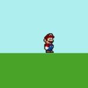
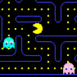
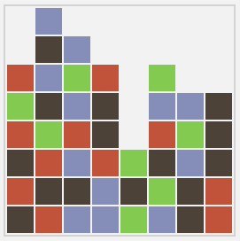
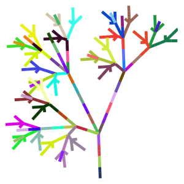
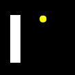
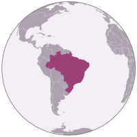

 - tagline: Explore Fable through fun demos!

# Fable samples

Fable works great for creating [server-side node.js](https://nodejs.org/en/) application,
client-side browser based applications and even [desktop electron-based
applications](http://electron.atom.io/). You can find a number of Fable examples and demos
of all kinds in the [samples directory on
GitHub](https://github.com/fable-compiler/samples-browser). Here, is a couple
of selected examples with longer explanation.

You can also contribute more examples by sending us a pull
request [for the samples directory](https://github.com/fable-compiler/samples-browser)!

## Fun and games

### [Super Fable Mario](https://github.com/fable-compiler/samples-browser/tree/master/mario)

Mario clone, based on functional reactive [sample written in
Elm](http://debug.elm-lang.org/edit/Mario.elm). The Fable version is using HTML 5
canvas to render the background and an `img` tag showing the Mario (using animated GIFs).
You can view the [raw source code on GitHub](https://github.com/fable-compiler/samples-browser/tree/master/mario/src).   

### [Ozmo game](https://github.com/fable-compiler/samples-browser/tree/master/ozmo)

Phil Trelford's [classic Ozmo game](https://twitter.com/ptrelford/status/475395178208174080), originally hosted
[on BitBucket](https://bitbucket.org/ptrelford/ozmo) ported to Fable! Shows how to handle keyboard events and
use HTML5 canvas. You can also get it (as a JavaScript app) from [the Windows
Store](https://www.microsoft.com/en-gb/store/apps/ozmo/9nblggh4rjng). View the [raw source code on
GitHub](https://github.com/fable-compiler/samples-browser/tree/master/ozmo/src).

### [Pacman](https://github.com/fable-compiler/samples-browser/tree/master/pacman)

Pacman finds himself in a grid filled with monsters... This is the most complex sample here.
It involves rendering the maze, AI for the ghosts, user interaction and even playing sound effects.
The game has some brief commentary, but if you want to learn Fable, look at the above examples
first. The [raw source code is on GitHub](https://github.com/fable-compiler/samples-browser/tree/master/pacman/src).

### [SameGame](https://github.com/fable-compiler/samples-browser/tree/master/samegame)

This demo shows a Fable implementation of SameGame. The functional implementation of the game follows
the *type-first design* approach and consists of three main components: _types_, _game logic_ and _front
end_. This sample has been contributed by [Leif Battermann](https://twitter.com/leifbattermann). You can
find the [full source code on GitHub](https://github.com/fable-compiler/samples-browser/tree/master/samegame/src).

### [Interactive L-system generator](https://github.com/fable-compiler/samples-browser/tree/master/lsystem)

This demo is based on [L-system workshop](https://github.com/Andrea/Lsystem) by Andrea Magnorsky
and Ross McKinlay. Rather than working on the tasks they gave us, Tomas Petricek compiled it with Fable,
so that you can play with it in a browser!

### [Pong](https://github.com/fable-compiler/samples-browser/tree/master/pong)

This Fable version of pong is using HTML 5 canvas to render a whole two player pong game.
The [full source code is on GitHub](https://github.com/fable-compiler/samples-browser/tree/master/pong/src).

## Productivity

### [TodoMVC with React](https://github.com/fable-compiler/samples-browser/tree/master/react-todomvc)

This is a port of [React TodoMVC](http://todomvc.com/examples/react/) to show how easy
is to take advantage of the full power of [React](https://facebook.github.io/react/) in Fable apps.
You can also compare the [F# source code](https://github.com/fable-compiler/samples-browser/tree/master/vue-todomvc)
with the [original JS implementation](https://github.com/tastejs/todomvc/tree/gh-pages/examples/react)
to see the advantages of Fable programming. And remember [Fable is also compatible with React Native](http://www.navision-blog.de/blog/2016/08/06/fable-react-native/) for mobile development!

### [TodoMVC with Redux](https://github.com/fable-compiler/samples-browser/tree/master/redux-todomvc)

This is a port of [Redux TodoMVC](https://github.com/reactjs/redux/tree/master/examples/todomvc)
and the third instalment in the Fable TodoMVC series. [Redux](http://redux.js.org/) is a predictable
state container for JavaScript apps, easy to use and compatible with functional patterns.
Redux greatly improves your development experience with extensions like [Redux DevTools](http://zalmoxisus.github.io/redux-devtools-extension/)
allowing for live code editing combined with a time traveling debugger.

## Visualizations

### [D3 world tour](https://github.com/fable-compiler/samples-browser/tree/master/d3map)

This demo is a Fable port of [Mike Bostock's World Tour](http://bl.ocks.org/mbostock/4183330)
D3 demo. It uses the D3 library to create a visualization that loops through all countries of
the world and shows them on the globe one by one. You can find the [full source code on
GitHub](https://github.com/fable-compiler/samples-browser/tree/master/d3map).

### [Hokusai and fractals](https://github.com/fable-compiler/samples-browser/tree/master/hokusai)

This demo is based on Tomas Petricek's [F# Advent Calendar post](http://tomasp.net/blog/2014/japan-advent-art-en/)
that explores Japanese art using the (now defunct) Freebase type provider and renders
The Great Wave by Hokusai using the Julia fractal.
View the [raw source code on GitHub](https://github.com/fable-compiler/samples-browser/tree/master/hokusai/src).

### [WebGL Geometry Terrain](https://github.com/fable-compiler/samples-browser/tree/master/webGLTerrain)

This demo is a Fable port of the [WebGL Geometry Terrain](http://threejs.org/examples/#webgl_geometry_terrain)
three.js demo. It uses the three.js library to randomly generate a 3D terrain which can be navigated in a first-person view.
The code was originally written by [John Quigley](https://github.com/jmquigs) for FunScript,
you can find [Fable's version on GitHub](https://github.com/fable-compiler/samples-browser/tree/master/webGLTerrain/src).

## Something missing?

### [Send us a pull request!](https://github.com/fable-compiler/Fable/tree/master/samples)

Do you have a nice demo using Fable? Send us a pull request!
We'd love to add more examples of using Fable in reactive web applications, server-side
node applications and other domains that rely on JavaScript. You can add demos to the
[samples folder in Fable repo](https://github.com/fable-compiler/Fable/tree/master/samples),
or just add a link from [this page](https://github.com/fable-compiler/Fable).
