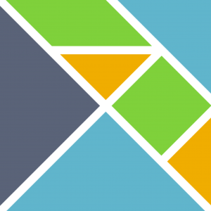

 - tagline: Explore Fable through fun demos!

# Fable samples

Fable works great for creating [server-side node.js](https://nodejs.org/en/) application,
client-side browser based applications and even [desktop electron-based
applications](http://electron.atom.io/). You can find a number of Fable examples and demos
of all kinds in the [samples directory on
GitHub](https://github.com/fable-compiler/Fable/tree/master/samples). Here, is a couple
of selected examples with longer explanation.

You can also contribute more examples by sending us a pull
request [for the samples directory](https://github.com/fable-compiler/Fable/tree/master/samples)!

## Fun and games

### [Super Fable Mario](samples/mario/index.html)

Mario clone, based on functional reactive [sample written in
Elm](http://debug.elm-lang.org/edit/Mario.elm). The Fable version is using HTML 5
canvas to render the background and an `img` tag showing the Mario (using animated GIFs).
You can view the [raw source code on GitHub](https://github.com/fable-compiler/Fable/blob/master/samples/browser/mario/mario.fsx).   

### [Ozmo game](samples/ozmo/index.html)

Phil Trelford's [classic Ozmo game](https://twitter.com/ptrelford/status/475395178208174080), originally hosted
[on BitBucket](https://bitbucket.org/ptrelford/ozmo) ported to Fable! Shows how to handle keyboard events and
use HTML5 canvas. You can also get it (as a JavaScript app) from [the Windows
Store](https://www.microsoft.com/en-gb/store/apps/ozmo/9nblggh4rjng). View the [raw source code on
GitHub](https://github.com/fable-compiler/Fable/blob/master/samples/browser/ozmo/ozmo.fsx).

### [Pacman](samples/pacman/index.html)

Pacman finds himself in a grid filled with monsters... This is the most complex sample here.
It involves rendering the maze, AI for the ghosts, user interaction and even playing sound effects.
The game has some brief commentary, but if you want to learn Fable, look at the above examples
first. The [raw source code is on GitHub](https://github.com/fable-compiler/Fable/blob/master/samples/browser/pacman/pacman.fsx).

### [SameGame](samples/samegame/index.html)

This demo shows a Fable implementation of SameGame. The functional implementation of the game follows
the *type-first design* approach and consists of three main components: _types_, _game logic_ and _front
end_. This sample has been contributed by [Leif Battermann](https://twitter.com/leifbattermann). You can
find the [full source code on GitHub](https://github.com/fable-compiler/Fable/blob/master/samples/browser/samegame/samegame.fsx).

### [Interactive L-system generator](samples/lsystem/index.html)

This demo is based on [L-system workshop](https://github.com/Andrea/Lsystem) by Andrea Magnorsky
and Ross McKinlay. Rather than working on the tasks they gave us, I compiled it with Fable, so that you
can play with it in a browser!

## Productivity

### [TodoMVC with Elm architecture](samples/virtualdom/index.html)

This demo is an implementation of the [Elm architecture](http://guide.elm-lang.org/architecture/)
using the same [virtual-dom](https://github.com/Matt-Esch/virtual-dom) as Elm originally used.
This architecture makes it easy to create complex and maintainable web applications.
Contributed by [Tomas Jansson](https://twitter.com/TomasJansson).

### [Testing with NUnit](samples/nunit/index.html)

This tutorial shows how to compile NUnit tests so they can be run in JS with [Mocha](https://mochajs.org).
You can view the [source code](https://github.com/fable-compiler/Fable/blob/master/samples/node/nunit/index.fsx),
[package.json](https://github.com/fable-compiler/Fable/blob/master/samples/node/nunit/package.json) and
[fableconfig.json](https://github.com/fable-compiler/Fable/blob/master/samples/node/nunit/fableconfig.json) on
GitHub. This is done via a [plugin](http://fable-compiler.github.io/docs/plugins.html), illustrating the
extensibility of Fable.

## Visualizations

### [D3 world tour](samples/d3map/index.html)

This demo is a Fable port of [Mike Bostock's World Tour](http://bl.ocks.org/mbostock/4183330)
D3 demo. It uses the D3 library to create a visualization that loops through all countries of
the world and shows them on the globe one by one. You can find the [full source code on
GitHub](https://github.com/fable-compiler/Fable/blob/master/samples/browser/d3map/d3map.fsx).

### [Hokusai and fractals](samples/hokusai/index.html)

This demo is based on Tomas Petricek's [F# Advent Calendar post](http://tomasp.net/blog/2014/japan-advent-art-en/)
that explores Japanese art using the (now defunct) Freebase type provider and renders
The Great Wave by Hokusai using the Julia fractal.
View the [raw source code on GitHub](https://github.com/fable-compiler/Fable/blob/master/samples/browser/hokusai/hokusai.fsx).

### [WebGL Geometry Terrain](samples/webGLTerrain/index.html)

This demo is a Fable port of the [WebGL Geometry Terrain](http://threejs.org/examples/#webgl_geometry_terrain)
three.js demo. It uses the three.js library to randomly generate a 3D terrain which can be navigated in a first-person view.
The code was originally written by [John Quigley](https://github.com/jmquigs) for FunScript,
you can find [Fable's version on GitHub](https://github.com/fable-compiler/Fable/blob/master/samples/browser/webGLTerrain/webGLTerrain.fsx).

## Server-side node.js

### [Simple static server](samples/server/index.html)

Minimal example that shows how to use Fable to create a node.js HTTP server that
hosts static files from the current directory using the `serve-static` package.
You can view the [source code](https://github.com/fable-compiler/Fable/blob/master/samples/node/server/index.fsx),
[package.json](https://github.com/fable-compiler/Fable/blob/master/samples/node/server/package.json) and
[fableconfig.json](https://github.com/fable-compiler/Fable/blob/master/samples/node/server/fableconfig.json) on
GitHub.

### [Express web framework demo](samples/express/index.html)

Example of using Fable to create a web application using [Express](http://expressjs.com/),
a fast, unopinionated, minimalist web framework for Node.js. The
[raw source code](https://github.com/fable-compiler/Fable/blob/master/samples/node/server/index.fsx) is
on GitHub, together with the configuration in
[package.json](https://github.com/fable-compiler/Fable/blob/master/samples/node/server/package.json) and
[fableconfig.json](https://github.com/fable-compiler/Fable/blob/master/samples/node/server/fableconfig.json).

## Something missing?

### [Send us a pull request!](https://github.com/fable-compiler/Fable/tree/master/samples)

Do you have a nice demo using Fable? Send us a pull request!
We'd love to add more examples of using Fable in reactive web applications, server-side
node applications and other domains that rely on JavaScript. You can add demos to the
[samples folder in Fable repo](https://github.com/fable-compiler/Fable/tree/master/samples),
or just add a link from [this page](https://github.com/fable-compiler/Fable).
