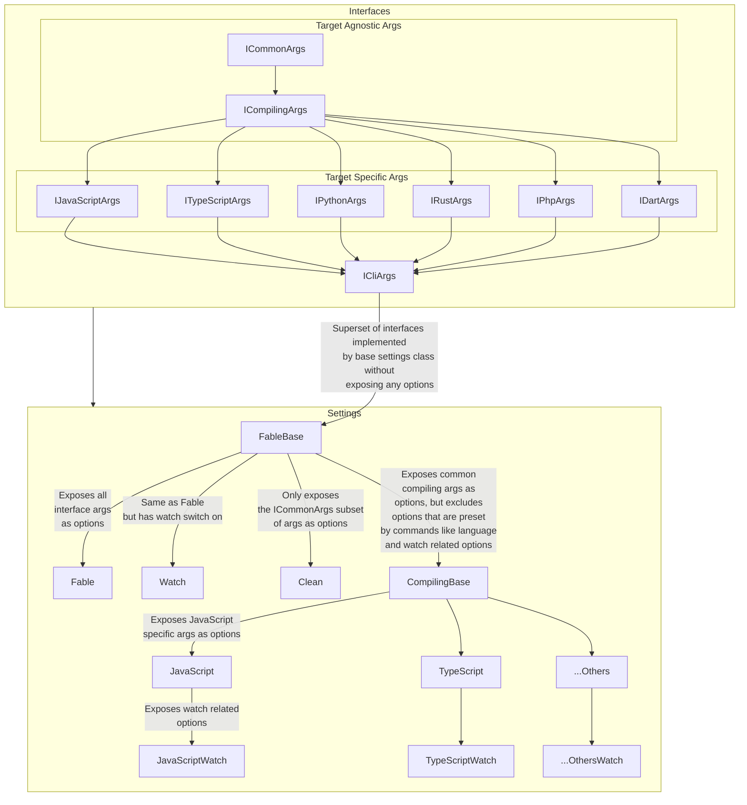

# CLI

This reworked CLI uses Spectre.Console to manage the CLI interface.
Using the framework, we are able to reason about the settings more
intuitively, although it uses a C# like OOP approach.

The value provided by offloading the CLI abstraction to a library for
the Fable CLI tool is worth this cost.

## Backwards Compatibility

This implementation permits all operations being handled from the default
command, except for `clean`. This maintains backwards compatibility.

All previous switches and commands are supported the same.

Deprecated options such as `--verbose` and `--silent` are still functional,
although now hidden. These switches are superseded by the `--verbosity`
option. `--verbosity` takes precedence over the deprecated switches.

## Future Proofing

As more targets mature in Fable, the need to separate CLI options and switches
for the different targets will grow.

While the backing compilation system is not changed, the CLI interface is
designed for this eventuality.

This provides a structure that is compatible with the current
compiler backing, as all `Setting` types
are compatible with the superset of args.
This is a non issue for the CLI consumers,
as each `Setting` type only exposes their
specific options via attributes.

The structure lends itself to iteration
towards allowing targets to safely add
their own switches as desired, and also
create consuming functions of the CLI interface
for different targets to handle their
subset of Cli args only, with intellisense
completions that are not polluted by other
target language options.
